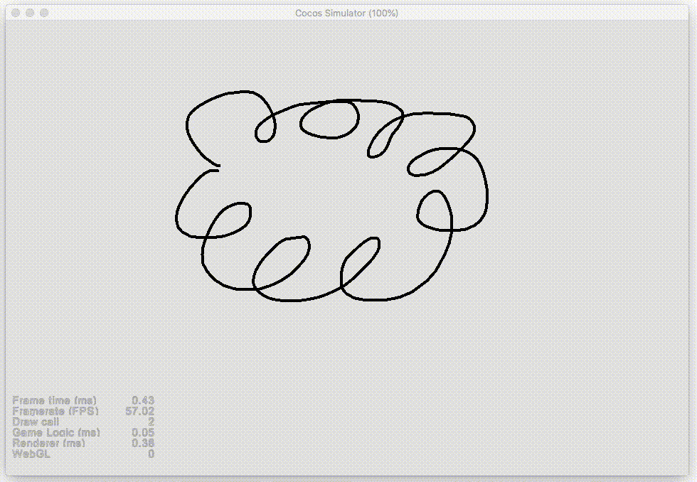

# Cocos Brush

A Sample project demostrating how to use cc.Graphics as a brush to draw customized lines

## How to use

1. Open `Scene/brush-sample-scene`
2. Change `Bursh Type` on `DrawingCanvas`
3. Run the sample and draw with your mouse
4. Press `space` to see watch replay

## Demo

## Reference 
http://perfectionkills.com/exploring-canvas-drawing-techniques/

